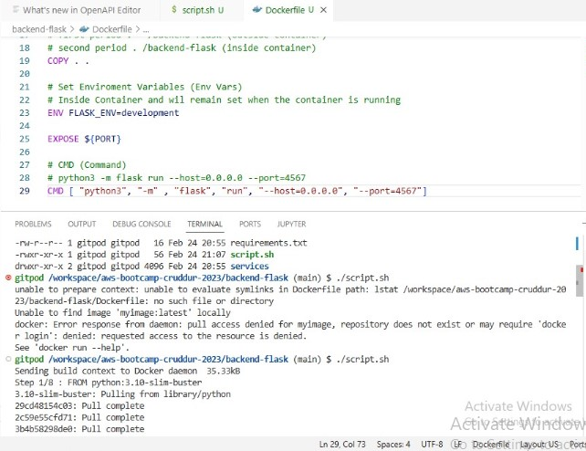
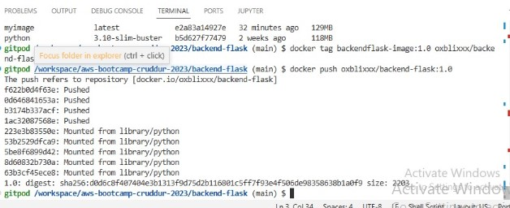

# Week 1 — App Containerization

This week, I focused on containerizing the application using Docker. I created separate Dockerfiles for both the frontend and the backend services, allowing each component of the app to be packaged into its own container. Afterward, we integrated both containers into a single Docker Compose file, which simplifies the process of managing and running both services together in a development or production environment.

## Homework challenge
* [Dockerize Backend app](#Dockerize-Backend-App)
* [Dockerize Frontend app](#Dockerize-Frontend-App)
* [Configure Docker Compose](#Configure-both-the-frontend-and-backend-services-within-a-Docker-Compose)
* [Integrate Dynamo DB and Postgresql](#Integrate-Dynamo-DB-and-Postgresql)
* [Research Best Docker Practices](#Research-Best-Docker-Practices)
* [Container Security Tool](#Container-Security-Tool)
* [Setup-Snyk](#Setup-Snyk)
* [Implement a health check](#Implement-a-health-check)
* [Error Encountered](#Error-Encountered)

***
## Dockerize Backend App
First, I created the Dockerfile for the **Backend**. Below is the code I used for the Dockerfile:

```Dockerfile
FROM python:3.10-slim-buster
WORKDIR /backend-flask
COPY requirements.txt requirements.txt
RUN pip3 install -r requirements.txt
COPY . .
ENV FLASK_ENV=development
EXPOSE ${PORT}
CMD [ "python3", "-m" , "flask", "run", "--host=0.0.0.0", "--port=4567"]
```

A script file that contains the necessary commands to execute the Dockerfile build is created [dockerfile script](../dockerfile-build.sh).

```sh
#!/bin/bash
docker build -t backend-flaskimage .
docker run backend-flaskimage
```

Navigate to the current directory where the script is located, and run the following Linux command to make the script executable and run it.
```
chmod +x dockerfile-build.sh
.dockerfile-build.sh

```



## Dockerize Frontend App
I created the Dockerfile for the **Frontend**. Below is the code I used for the Dockerfile

```Dockerfile
FROM node:16.18 AS builder-frontend
WORKDIR /frontend-react-js
COPY frontend-react-js/package.json frontend-react-js/package-lock.json ./
RUN npm install
COPY frontend-react-js/src ./src/
COPY frontend-react-js/public ./public/
ENV PORT=3000
EXPOSE ${PORT}
CMD ["npm", "start"]
```

>**NB**: Each service has its own Dockerfile located within its respective folder, [frontend-react-js](./frontend-react-js) & [backend-flask](./backend-flask) ensuring that the configurations for the frontend and backend are separate.

## Upload a Docker image to Docker Hub.
The built images for both the  **Backend and Frontend** are pushed to [DockerHub](https://hub.docker.com). Upon login via terminal, proceeded to tag the images. Create a repository for the images and create an **access token** to login.

```sh
docker login -u <username>
docker tag backendflask-image:1.0 oxblixxx/backend-flask:1.0
docker tag <image_id> <dockerhub_username>/<repository_name>:<tag>
```
I ran the following command to push the image to my Docker Hub repository.

```sh
docker push oxblixxx/backend-flask:1.0
docker push <dockerhub_username>/<repository_name>:<tag>
```




***
## Configure both the frontend and backend services within a Docker Compose
Both services are defined and configured within a single Docker Compose file, allowing them to be built and run together as a unified application

```yaml
services:
  backend-flask:
    environment:
      FRONTEND_URL: "https://3000-${GITPOD_WORKSPACE_ID}.${GITPOD_WORKSPACE_CLUSTER_HOST}"
      BACKEND_URL: "https://4567-${GITPOD_WORKSPACE_ID}.${GITPOD_WORKSPACE_CLUSTER_HOST}"
    build: ./backend-flask
    ports:
      - "4567:4567"
    volumes:
      - ./backend-flask:/backend-flask
  frontend-react-js:
    environment:
      REACT_APP_BACKEND_URL: "https://4567-${GITPOD_WORKSPACE_ID}.${GITPOD_WORKSPACE_CLUSTER_HOST}"
    build: ./frontend-react-js
    ports:
      - "3000:3000"
    volumes:
      - ./frontend-react-js:/frontend-react-js
# the name flag is a hack to change the default prepend folder
# name when outputting the image names
networks: 
  internal-network:
    driver: bridge
    name: cruddur
```

## Integrate Dynamo DB and Postgresql
We will also integrate [DynamoDB Local](https://docs.aws.amazon.com/amazondynamodb/latest/developerguide/DynamoDBLocal.html) and PostgreSQL for local testing. These databases will simulate the cloud environments, allowing us to test and develop locally before transitioning to the cloud for production deployment.

```yaml
services:
  db:
    image: postgres:13-alpine
    restart: always
    environment:
      - POSTGRES_USER=postgres
      - POSTGRES_PASSWORD=password
    ports:
      - '5432:5432'
    volumes: 
      - db:/var/lib/postgresql/data
volumes:
  db:
    driver: local
```

```yaml
  dynamodb-local:
    # https://stackoverflow.com/questions/67533058/persist-local-dynamodb-data-in-volumes-lack-permission-unable-to-open-databa
    # We needed to add user: root to get this working.
    user: root
    command: "-jar DynamoDBLocal.jar -sharedDb -dbPath ./data"
    image: "amazon/dynamodb-local:latest"
    container_name: dynamodb-local
    ports:
      - "8000:8000"
    volumes:
      - "./docker/dynamodb:/home/dynamodblocal/data"
    working_dir: /home/dynamodblocal
    networks:
      - app-network
```

After spinning up the docker compose file, run `docker ps` this should show that the containers are running with no errors. To access `postgres` via the cli, postgres-client needs to be installed. Also the installation script is added to .gitpod.yaml to install on fresh spinning up of gitpod.

```sh
curl -fsSL https://www.postgresql.org/media/keys/ACCC4CF8.asc|sudo gpg --dearmor -o /etc/apt/trusted.gpg.d/postgresql.gpg
echo "deb http://apt.postgresql.org/pub/repos/apt/ `lsb_release -cs`-pgdg main" |sudo tee  /etc/apt/sources.list.d/pgdg.list
sudo apt update
sudo apt install -y postgresql-client-13 libpq-dev   \
```

To access `postgres` DB, use the `psql -Upostgres -h localhost -p` command to login, the default password is `password`. VSCODE extensions can also be used to access the database. 


Meanwhile for DYNAMO-DB, it hosted on `8000`, and to interact with it, AWS CLI needs to be installed! AWS cli is installed according to the docs

```sh
curl "https://awscli.amazonaws.com/awscli-exe-linux-x86_64.zip" -o "awscliv2.zip"
unzip awscliv2.zip
sudo ./aws/install
```

Also, AWS cli installation script is added to .gitpod.yaml to install on startup. Interact with DYNAMO-DB with this below commands.

```sh
aws dynamodb list-tables --endpoint-url http://localhost:8000
```

Use this to create table and add contents in the table

```sh
aws dynamodb create-table \
    --table-name Users \
    --attribute-definitions AttributeName=UserId,AttributeType=S \
    --key-schema AttributeName=UserId,KeyType=HASH \
    --provisioned-throughput ReadCapacityUnits=5,WriteCapacityUnits=5 \
    --endpoint-url http://localhost:8000


aws dynamodb put-item \
    --table-name Users \
    --item '{"UserId": {"S": "123"}, "Name": {"S": "John Doe"}}' \
    --endpoint-url http://localhost:8000
```

Now run this list-tables command to see that it works correctly

```sh
 aws dynamodb list-tables --endpoint-url http://localhost:8000
```

Here should be the results

```sh
{
    "TableNames": [
        "Music",
        "Users"
    ]
}

```

###
OPENAPI extensions is downloaded on VSCODE to create new api's, the file is located in the `.backend-flask` directory. Open the api file, then open the api extension to view the api endpoints!!
## SETTING DYNAMO DB
https://github.com/100DaysOfCloud/challenge-dynamodb-local


## Research Best Docker Practices
For this task, I consulted ChatGPT to gather insights on the best practices for writing a Dockerfile and Docker Compose file. I then applied those recommendations to optimize the Dockerfile, which include the following:
1. Ensured to use official images
2. Document the Dockerfile by putting comments where necessary
3. Used environment variables
4. Use the correct commands
5. Clean up unnecessary files before exiting.
6. Container should run in non-root user mode.
7. Use container security tools to check for Vulns.


## Container Security Tools
* SNYK
* Amazon Inspector
* Clair
* AWS Secrets Manager
* Hashicorp Vault

## Setup Snyk
First, sign up for an account on Snyk. After registering, generate an API key by clicking on your avatar in the bottom-left corner, navigating to Account Settings > Auth Token, and then clicking to display the token.

Next, install the [Snyk CLI](https://docs.snyk.io/snyk-cli/install-the-snyk-cli) on your local machine by following the installation guide here. You can install it using npm with the following command:

```sh
npm install snyk -g
```

Then authenticate with the API using

```sh
snyk auth <api key>
```

Monitor Your Project:
To confirm that Snyk is correctly authenticated and monitoring your project, run:

```sh
snyk monitor
```
Check for Vulnerabilities:
Finally, to check for vulnerabilities in a specific Docker container, run:

```sh
snyk container test <container name>
```

***

## Implement a health check
Implenting a health check monitors the health of the services to  check if it is healthy or unhealthy. [blogs_!](https://lumigo.io/container-monitoring/docker-health-check-a-practical-guide/) [blog-2](https://dev.to/idsulik/a-beginners-guide-to-docker-health-checks-and-container-monitoring-3kh6) [video_1](https://www.youtube.com/watch?v=mgMhQo279Xk)
we have two services, the backend-flask and the frontend-react-js

```sh
 healthcheck:
      test: ["CMD-SHELL", "curl --fail http://localhost:portnumber/health || exit 1"]
      interval: 30s
      timeout: 10s
      retries: 3https://4567-oxblixxx-awsbootcampcru-7wlfsdpa925.ws-eu120.gitpod.io/api/activites/notification
```

the "portnumber" is to be replaced with the corresponding port number
this code runs at every interval of 30 seconds and timeout after 10 seconds. After 3 retries, it renders the service unhealthy.
The **Depends_on,** configuration ensures that the backend service is started before the frontend service.

```sh
 depends_on:
      - backend-flask
```


## Error Encountered

### Docker Multistage Build
I had no prior knowledge about docker multi-stage build, made research on ChatGPT. Merged both contents from my dockerfile in the backend-flask directory and the 
frontend-react-js directory. Then I got a NPM error

```sh
npm ERR! code ENOENT
npm ERR! syscall open
npm ERR! path /frontend-react-js/package.json
npm ERR! errno -2
npm ERR! enoent ENOENT: no such file or directory, open '/frontend-react-js/package.json'
npm ERR! enoent This is related to npm not being able to find a file.
npm ERR! enoent 

npm ERR! A complete log of this run can be found in:
npm ERR!     /root/.npm/_logs/2023-03-01T02_20_22_280Z-debug-0.log
```

Then I updated the COPY command in my dockerfile

```sh
COPY frontend-react-js/package.json frontend-react-js/package-lock.json ./
COPY frontend-react-js/src ./src/
COPY frontend-react-js/public ./public/
```

here is my final code

```sh
# Build backend
FROM python:3.10-slim-buster AS builder-backend

WORKDIR /backend-flask

COPY requirements.txt requirements.txt
RUN pip3 install -r requirements.txt

COPY . .

ENV FLASK_ENV=development

EXPOSE ${PORT}
CMD [ "python3", "-m" , "flask", "run", "--host=0.0.0.0", "--port=4567"]

# Build frontend
FROM node:16.18 AS builder-frontend

WORKDIR /frontend-react-js

COPY frontend-react-js/package.json frontend-react-js/package-lock.json ./
RUN npm install
COPY frontend-react-js/src ./src/
COPY frontend-react-js/public ./public/

ENV PORT=3000

EXPOSE ${PORT}
CMD ["npm", "start"]

# Combine backend and frontend
FROM python:3.10-slim-buster

COPY --from=builder-backend /backend-flask /backend-flask
COPY --from=builder-frontend /frontend-react-js /frontend-react-js

EXPOSE ${PORT}

CMD ["python3", "-m", "flask", "run", "--host=0.0.0.0", "--port=4567"]

```

Also while connecting to psql, I got this error

```sh
psql -Upostgres
psql: error: connection to server on socket "/var/run/postgresql/.s.PGSQL.5432" failed: No such file or directory
        Is the server running locally and accepting connections on that socket
```

The fix was to include the `host`, otherwise postgres listens for connections from the host, meaning it tries to look at the host instead of the docker container && the default password is password.

```sh
psql -Upostgres -h localhost
```
Now it worked smoothly


